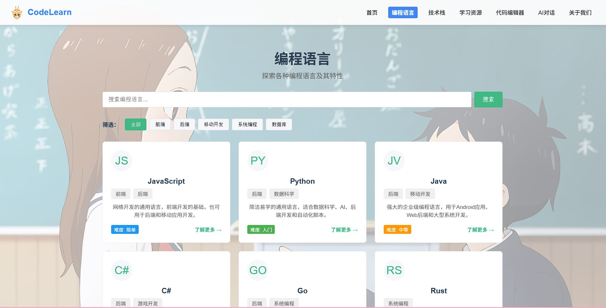
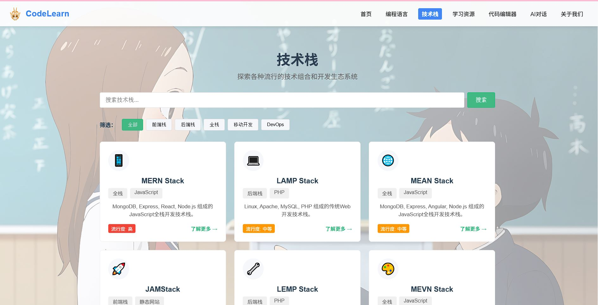
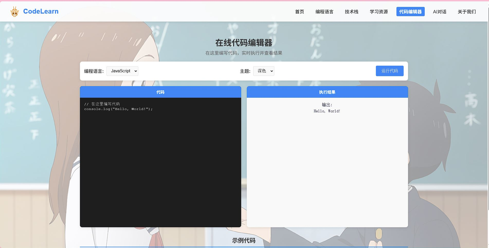

# CodeLearn - 编程学习平台

<div align="center">
  
  <h3>探索编程的世界，成为技术大师</h3>
</div>

## 📑 项目介绍

CodeLearn是一个现代化的编程学习平台，旨在为开发者提供丰富的学习资源、编程语言指南和技术栈探索。平台融合了交互式学习和AI辅助功能，帮助用户更高效地学习编程知识。

### ✨ 主要特点

- 🌐 多种编程语言学习资源
- 📚 完整的技术栈学习路径
- 💻 在线代码编辑器
- 🤖 AI辅助学习对话
- 📱 响应式设计，支持多设备访问

## 📸 界面展示

<div align="center">

### 主要页面展示

| 首页 | 编程语言页面 |
|:---:|:---:|
|  |  |
| **平台核心功能集中展示** | **多种编程语言的详细介绍** |

| 技术栈页面 | 学习资源页面 |
|:---:|:---:|
|  |  |
| **主流技术栈的详细学习路径** | **丰富的学习资料和教程** |

### 特色功能

| 在线代码编辑器 | AI对话助手 |
|:---:|:---:|
|  |  |
| **实时编码与执行环境** | **智能学习辅助与问答** |

### 响应式设计

| 移动端首页 | 移动端功能页 |
|:---:|:---:|
|  |  |
| **完美适配移动设备** | **移动端功能无缝体验** |

</div>

> **注意**: 截图文件夹需手动创建。运行以下命令准备截图目录：
> ```bash
> mkdir -p screenshots
> ```
> 
> 建议的截图尺寸：
> - 桌面视图: 1280×720 像素
> - 移动视图: 375×812 像素
> 
> 所有截图都应当保存为PNG格式，以保持透明度和高质量。您可以使用浏览器开发者工具的截图功能或专业截图工具获取界面图像。

## 🎬 动态演示

<div align="center">

### 功能交互展示

| 功能导航演示 | 编程语言交互 |
|:---:|:---:|
|  |  |
| **流畅的页面导航体验** | **编程语言内容的交互展示** |

| 代码编辑器实时演示 | AI对话交互演示 |
|:---:|:---:|
|  |  |
| **代码编写与实时执行** | **智能问答与学习辅助** |

</div>

> **提示**：GIF动画制作可使用[ScreenToGif](https://www.screentogif.com/)或[LICEcap](https://www.cockos.com/licecap/)等工具录制，建议控制每个GIF文件大小在2MB以内，以保证README加载速度。

## 🚀 快速开始

### 前提条件

- Node.js (v14.0.0+)
- npm (v6.0.0+)

### 安装依赖
```bash
 npm install monaco-editor-vue3 --save
```

```bash
npm install
```

### 开发环境

启动开发服务器，支持热重载：

```bash
npm run serve
```

访问：`http://localhost:8080`

### 生产环境构建

```bash
npm run build
```

### 代码检查与修复

```bash
npm run lint
```

## 📂 项目结构

```
src/                # 源代码
  ├── assets/       # 静态资源（图片、字体等）
  │   └── images/   # 图片资源
  ├── components/   # 可复用组件
  ├── router/       # 路由配置
  ├── store/        # Vuex状态管理
  ├── services/     # API服务和数据请求
  ├── utils/        # 工具函数
  ├── views/        # 页面视图组件
  ├── App.vue       # 根组件
  └── main.js       # 应用入口文件
public/             # 公共资源目录
  ├── images/       # 公共图片资源
  └── index.html    # HTML模板
```

## 🛠️ 技术栈

- Vue.js - 前端框架
- Vue Router - 路由管理
- Vuex - 状态管理
- Axios - HTTP客户端

## 📱 页面与功能

- **首页**: 提供编程语言和技术栈概览
- **编程语言**: 详细的编程语言学习资源
- **技术栈**: 主流技术栈的详细介绍和学习路径
- **学习资源**: 课程、教程和学习材料
- **代码编辑器**: 在线编写和执行代码
- **AI对话**: 智能学习助手
- **关于我们**: 项目团队和联系信息

## 🤝 贡献指南

1. Fork该项目
2. 创建功能分支 (`git checkout -b feature/amazing-feature`)
3. 提交更改 (`git commit -m 'Add some amazing feature'`)
4. 推送到分支 (`git push origin feature/amazing-feature`)
5. 提交Pull Request

## 📄 许可证

本项目采用MIT许可证 - 详情请参阅 [LICENSE](LICENSE) 文件 